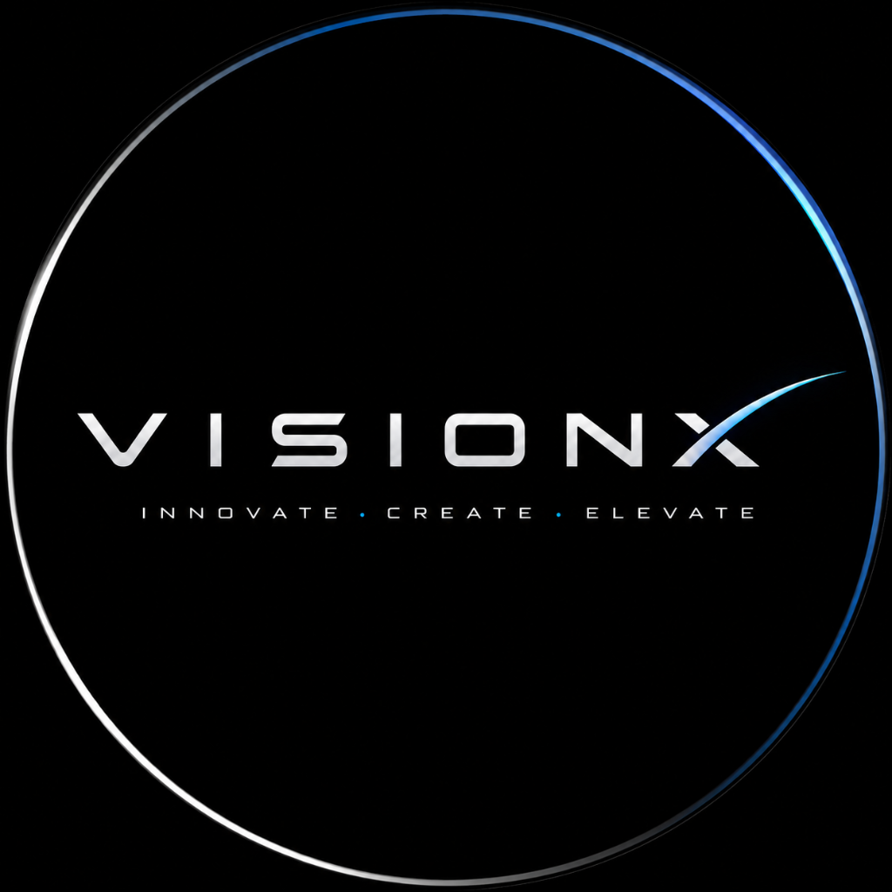

<div align="center">

  

  # VisionX Web Technology
  ### *Digital Experiences Beyond the Ordinary*

  [](LICENSE)
  [](https://threejs.org/)
  [](#-design-system--liquid-glass-ui)
  [](#)

  <p align="center">
    A flagship digital platform crafted with bespoke <b>Three.js WebGL spatial computing</b>, <b>Apple-inspired Liquid Glass UI</b>, a real-time in-browser <b>Executive CMS</b>, interactive <b>Client Review Engine</b>, and one-click direct <b>Gmail Integration</b>.
  </p>

  <p align="center">
    <a href="#-executive-leadership"><b>Executive Leadership</b></a> •
    <a href="#-key-features"><b>Key Features</b></a> •
    <a href="#-tech-stack"><b>Tech Stack</b></a> •
    <a href="#-getting-started"><b>Getting Started</b></a> •
    <a href="#-deployment"><b>Deployment</b></a>
  </p>

</div>

---

## 🌟 Overview

**VisionX Web Technology** is an elite digital engineering agency specializing in high-performance web platforms, bespoke Three.js 3D web experiences, and scalable enterprise full-stack solutions.

This codebase represents VisionX's official web platform, built from the ground up with zero bloat, pure vanilla JavaScript execution, hardware-accelerated shaders, dynamic client reviews, and direct executive connectivity.

---

## 👥 Executive Leadership

VisionX is founded and steered by six dedicated digital craftsmen:

<div align="center">

| Executive | Role & Specialization | Contact & Connect |
| :--- | :--- | :--- |
| **Deepak Kumar** | `CEO & Founder`<br>✦ **Web Development & Architecture** | [Instagram](https://www.instagram.com/deepak_h4x_?igsi=MWVmbGRyZGVvMWoxYg==) • [GitHub](https://github.com/AGzDeepak) • [Email](https://mail.google.com/mail/?view=cm&fs=1&to=deepakyuoyt@gmail.com&su=Inquiry%20for%20Deepak%20Kumar%20(CEO%20%26%20Founder)%20-%20VisionX) |
| **Balaji** | `Co-Founder & CTO`<br>✦ **Chief Technology Officer &bull; Frontend** | [Instagram](https://www.instagram.com/bala_zx_?igsi=MTZnZXJudWtreWxieA==) • [GitHub](https://github.com/balajibalaji72863-cyber) • [Email](https://mail.google.com/mail/?view=cm&fs=1&to=balajibalaji72863@gmail.com&su=Inquiry%20for%20Balaji%20(Co-Founder%20%26%20CTO)%20-%20VisionX) |
| **Inbaraj** | `Co-Founder & CSA`<br>✦ **Chief Solutions Architect &bull; Full Stack** | [Instagram](https://www.instagram.com/itz_inba_007/) • [GitHub](https://github.com/enbarajenba21-Tech) • [Email](https://mail.google.com/mail/?view=cm&fs=1&to=enbarjenba21@gmail.com&su=Inquiry%20for%20Inbaraj%20(Co-Founder%20%26%20CSA)%20-%20VisionX) |
| **Sanjay** | `Co-Founder & CDO`<br>✦ **Chief Design Officer &bull; UI / UX** | [Instagram](https://www.instagram.com/_.sanjuzz_x___?igsi=dnF1aG1nMmZoMmdl) • [GitHub](https://github.com/sanjayv152006-cmyk) • [Email](https://mail.google.com/mail/?view=cm&fs=1&to=sanjaysanju152006@gmail.com&su=Inquiry%20for%20Sanjay%20(Co-Founder%20%26%20CDO)%20-%20VisionX) |
| **Sivanesan** | `Co-Founder`<br>✦ **Head of Product Design &bull; UI / UX** | [Instagram](https://www.instagram.com/_x_o__mad__?igsi=dnp5a2RseDNnb2tu) • [GitHub](https://github.com/AGzDeepak) • [Email](https://mail.google.com/mail/?view=cm&fs=1&to=sivanesan010307@gmail.com&su=Inquiry%20for%20Sivanesan%20(Co-Founder%20%26%20Product%20Design)%20-%20VisionX) |
| **Boopathi** | `Co-Founder`<br>✦ **Creative Director &bull; Brand Identity** | [Instagram](https://www.instagram.com/b_o_o_p_a_t_h_i______?igsi=MWZwYmpmaGRwandjNA==) • [GitHub](https://github.com/AGzDeepak) • [Email](https://mail.google.com/mail/?view=cm&fs=1&to=boopathi3332@gmail.com&su=Inquiry%20for%20Boopathi%20(Co-Founder%20%26%20Creative%20Director)%20-%20VisionX) |

</div>

---

## ⚡ Key Features

### 🌌 1. Dedicated Obsidian Space Theme
* Custom-crafted dark cosmic theme featuring deep sapphire/obsidian surfaces, specular cyan glows (`#38bdf8`), and high-luminance typography.
* Integrated with hardware-accelerated WebGL ambient particle systems.

### 🔮 2. Three.js 3D WebGL Spatial Orb
* Real-time 3D particle sphere responding to cursor parallax and mouse velocity.
* Adaptive particle budgets, graceful WebGL fallbacks, and mobile battery optimization running at silky-smooth 60 FPS.

### 💎 3. Apple-Inspired Liquid Glass Design System
* Translucent multi-layered frosted glass panels (`backdrop-filter: blur(20px)`).
* Specular cyan lighting, inset reflection borders, and smooth micro-interactions.

### 📁 4. Real-Time In-Browser Executive CMS
* Accessible via the top navbar **Gateway** passkeys.
* Leadership can publish, edit, delete, and retheme showcase projects with instant live DOM synchronization and `localStorage` persistence.
* Dedicated **Live Demo ↗** URL integration allowing real-time linking to external live demos and apps.

### ⭐ 5. Interactive Client Review Engine
* Real-time client feedback showcase with verified badges, 5-star ratings, and timestamps.
* Integrated **`+ Write a Review`** modal with interactive star picker (`★ ★ ★ ★ ★`), audio feedback, and instant client review publishing.

### 👤 6. Interactive Founder Profile Sheets
* Tapping or clicking any founder photo opens an Executive Profile Details Sheet containing large portrait visuals, specialization badges, executive bios, and direct contact actions.

### ✉️ 7. 1-Click Direct Gmail Compose Routing
* Seamless browser-level Gmail integration (`mail.google.com/mail/?view=cm...`) with pre-filled recipient emails, subject headers, and message templates.

---


---

## 🔥 Firebase Cloud Database & Authentication Integration

VisionX Web Technology is seamlessly integrated with **Firebase Cloud Firestore** and **Firebase Authentication**:

### 1. Cloud Firestore Database Collections
* **`projects` Collection**:
  - Automatically syncs all portfolio projects, categories, visual themes, and **Live Demo ↗** URLs in real time (`onSnapshot`).
  - Supports full in-browser CRUD (Create, Read, Update, Delete) from the Executive CMS.
* **`reviews` Collection**:
  - Stores all verified client reviews and feedback submissions in the cloud.

### 2. Executive Authentication & Admin Authorization
* **Executive Admin Passes**: Deepak Kumar (`CEO & Founder`), Balaji (`Co-Founder & CTO`), Sanjay (`Co-Founder & CDO`), Inbaraj (`Co-Founder & CSA`), Sivanesan (`Co-Founder & Product Design`), and Boopathi (`Co-Founder & Creative Director`).
* Grants administrative CMS privileges to create and edit live showcase projects.

### 3. Setting Up Your Firebase Project
1. Create a project in the [Firebase Console](https://console.firebase.google.com/).
2. Enable **Cloud Firestore Database** (Start in test mode or production rules).
3. Enable **Authentication** (Email/Password provider).
4. Go to **Project Settings** → **General** → Copy your Web App SDK config.
5. Either:
   - Open the website, click **Gateway** → **☁️ Firebase Cloud**, paste your keys, and click **Save**.
   - Or paste your keys directly into [`js/firebase-config.js`](js/firebase-config.js).


## 🛠️ Tech Stack

* **Markup & Structure**: HTML5 (Semantic, Accessible, SEO Optimized)
* **Styling & Effects**: Pure Modern CSS3 (Custom CSS Properties, Glassmorphism, CSS Grid, Flexbox, Keyframe Motion)
* **Interactive Logic**: Vanilla JavaScript ES6+ (No external runtime dependencies)
* **3D Visuals & Shaders**: [Three.js r128](https://threejs.org/) (Particle systems, PointClouds, Canvas Shaders)
* **Fonts**: `Inter`, `-apple-system`, `BlinkMacSystemFont`

---

## 📁 Repository Structure

```plaintext
visionx-web-portfolio/
├── assets/
│   └── images/
│       ├── deepak-kumar.jpg      # Deepak Kumar (CEO & Founder)
│       ├── balaji.jpg            # Balaji (Founder)
│       ├── sanjay.png            # Sanjay (Founder)
│       ├── inbaraj.jpg           # Inbaraj (Founder)
│       ├── sivanesan.png         # Sivanesan (Founder)
│       ├── boopathi.jpg          # Boopathi (Founder)
│       ├── visionx-logo.png      # VisionX Official Logo
│       └── ...
├── css/
│   ├── style.css                 # Core CSS & Liquid Glass Design Tokens
│   ├── animations.css            # Scroll reveals & interactive keyframes
│   └── responsive.css            # Adaptive tablet & mobile breakpoints
├── js/
│   ├── main.js                   # Navigation, Smooth Scroll & Interactions
│   ├── three-scene.js            # Three.js 3D Particle Orb Manager
│   ├── animations.js             # IntersectionObserver Reveal Engine
│   └── portal.js                 # Executive CMS, Reviews & Gateway Hub
├── index.html                    # Single-page core application
└── README.md                     # Platform documentation
```

---

## 🚀 Getting Started (Local Development)

### 1. Clone the Repository
```bash
git clone https://github.com/AGzDeepak/visionx-web-portfolio.git
cd visionx-web-portfolio
```

### 2. Run Locally
You can run it with any local static server:

#### Using Python (Recommended):
```bash
python -m http.server 3000
```
Open **[http://localhost:3000](http://localhost:3000)** in your browser.

#### Using Node.js / `npx serve`:
```bash
npx serve .
```

#### Using VS Code Live Server:
Right-click `index.html` and select **"Open with Live Server"**.

---

## 🌐 Deployment

This platform is 100% static and zero-dependency, making it compatible with any hosting provider:

### Option A: Vercel (1-Click)
```bash
npx vercel
```

### Option B: Netlify
Drag and drop the project folder into [Netlify Drop](https://app.netlify.com/drop) or push to GitHub and link your repository.

### Option C: GitHub Pages
1. Go to repository **Settings** → **Pages**.
2. Under **Branch**, select `main` and `/ (root)`.
3. Click **Save** — your site will be live at `https://agzdeepak.github.io/visionx-web-portfolio/`.

---

## 📄 License & Ownership

Designed, engineered, and maintained by **VisionX Web Technology**.  
Licensed under the [MIT License](LICENSE).

<div align="center">
  <sub>VisionX Web Technology • Digital Experiences Beyond the Ordinary</sub>
</div>
